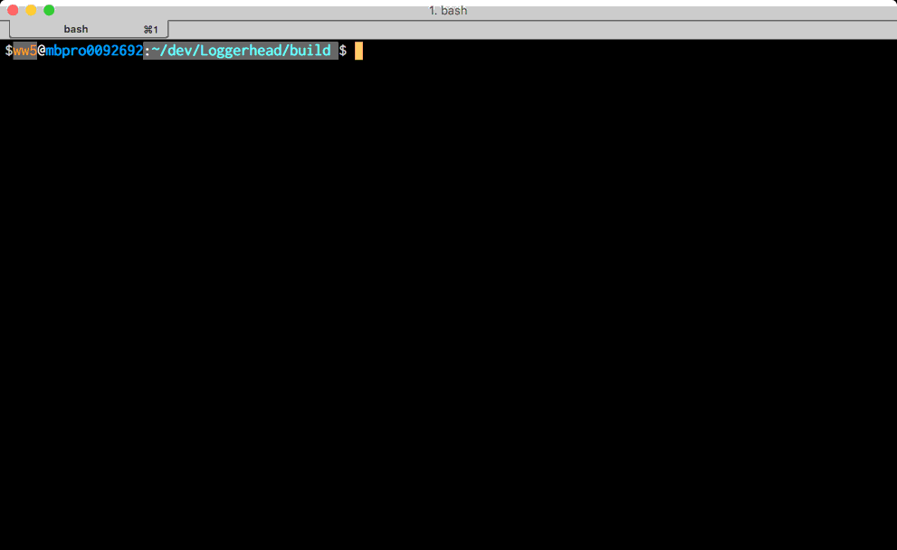

Loggerhead
==========

Logging and terminal stuff with BOTG_ package management

.. image:: https://c1.staticflickr.com/1/606/33135230306_71e4f916c5_b.jpg

This package provides the SPDLOG_ package for logging with a few bell and
whistle classes.

- terminal stuff

  - information (screen width, is a TTY) with `term::terminal_info`
  - coloring  with `term::color`
  - ASCII (with color!) progress bar with `term::progress_bar`

- SPDLOG_ logging with a progress bar

  - single thread `spdlog::progress_logger_mt` or
  - multi thread `spdlog::progress_logger_st`

Demo 1
------

.. code-block:: c++

    #include "spdlog/progress_logger.hh"

    void sleep_ms( int ms )
    {
        std::this_thread::sleep_for( std::chrono::milliseconds( ms ) );
    }

    int main()
    {
        //create a multi-threaded progress logger
        size_t n = 8;
        auto progress = spdlog::progress_logger_mt("demo",n);

        //do a calculation loop
        progress->warn( "Entering a calculation!" );
        for(auto i=1; i<=n-2; ++i)
        {
            sleep_ms( 500 );
            progress->info( "Completed task {}",i );

            //throw an error at task3
            if( i==3 )progress->error("YOU FAIL!");
        }
        sleep_ms( 1000 );
        progress->warn( "Whew! Calculation is over." );

        //go to next line
        std::cerr << "\n";

    }

Demo 2
------

.. code-block:: c++

    #include "spdlog/progress_logger.hh"

    void sleep_ms( int ms )
    {
        std::this_thread::sleep_for( std::chrono::milliseconds( ms ) );
    }

    int main()
    {
        //create a multi-threaded progress logger
        size_t n = 100; //100 tasks is a way to do 100%
        auto progress = spdlog::progress_logger_mt("demo2",n);

        //get the sink for more fine grained control
        auto sink = spdlog::sinks::progress_sink_mt::instance();
        //IMPORTANT: sink must be same threading level as progress_logger

        //turns off update of -1 task on every message
        sink->set_allow_autoupdate( false );

        //4% setup
        progress->info("Doing setup!");
        sleep_ms( 2000 );
        sink->update( -4 );

        //enter loop (90%)
        for( int i=1; i<=90; ++i )
        {
            sleep_ms( 100 );
            sink->update( -1 ); //do 1% of work
        }

        //6% wrapup
        progress->info("Doing wrapup!");
        sleep_ms( 1000 );
        sink->update( -6 );

        //go to next line
        std::cerr << "\n";

    }

.. _CMake: https://cmake.org/
.. _SPDLOG: https://github.com/gabime/spdlog
.. _BOTG: http://github.com/wawiesel/BootsOnTheGround
.. _Loggerhead: http://github.com/wawiesel/Loggerhead

